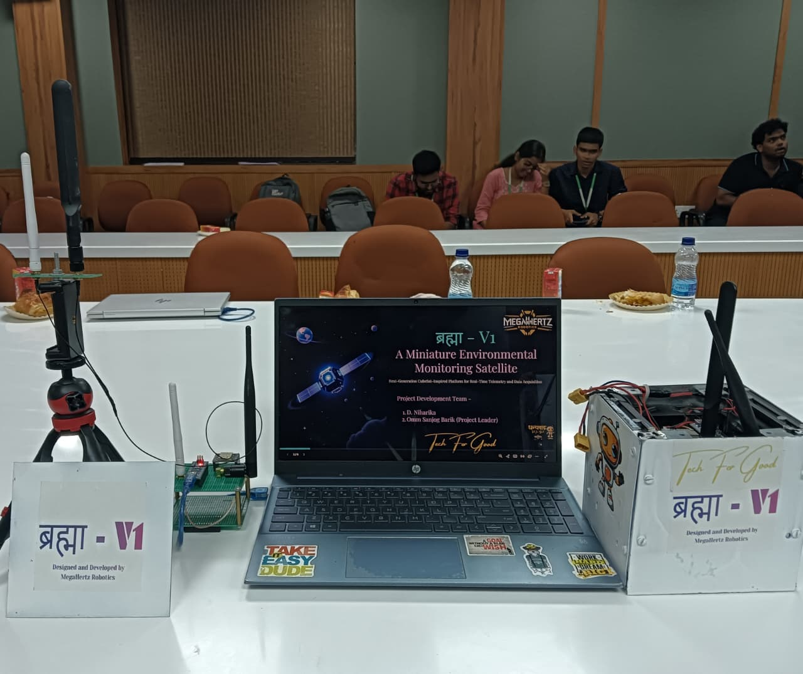

# Brahma-V1 Environment Monitoring CubeSat 🛰️
**PicoSat Telemetry & Distributed Computing System**

**Author:** Omm Sanjog Barik
**License:** MIT

---

## Overview
Brahma-V1 is a compact satellite-inspired telemetry and communication system built using a **distributed computing architecture**. The project uses three **Arduino Nano** boards working together to simulate the functionality of a CubeSat:

### Onboard Subsystems (Satellite Unit)
- **Nano-1:** Sensor data acquisition
- **Nano-2:** Data processing and LoRa transmission

### Ground Station
- **Nano-3:** Receiving LoRa packets and forwarding them to a computer
- **Python-based dashboard:** Displays real-time telemetry, plots sensor data, monitors system health, and shows communication statistics.

This project is designed for academic, research, and competition settings where low-cost satellite simulation is required.

---

## System Architecture

### 1. Satellite Unit (Onboard Module)

**Nano-1 — Sensor Acquisition Unit**
- Collects sensor payload data (temperature, humidity, pressure, light, etc.)
- Performs basic validation and filtering
- Transfers formatted telemetry frames to Nano-2 via **Serial/I²C**

**Nano-2 — Communication & Processing Unit**
- Receives telemetry packets from Nano-1
- Appends metadata (timestamps, packet ID, health flags)
- Transmits packets over **LoRa SX1278 (RA-02)**
- Handles retransmission logic and radio state management

*This design mimics real satellite subsystems such as OBC, Payload, and Radio.*

### 2. Ground Station (Receiver Module)

**Nano-3 — LoRa Ground Receiver**
- Listens for incoming LoRa packets
- Sends decoded telemetry to the computer over **USB serial**
- Feeds data to a Python dashboard for **real-time plotting and display**

*Acts as the mission control base station.*

---
### Physical Prototype
A photo of the completed sensor and communication units.

---

## 🌐 Communication Flow

The data path from sensor acquisition to the ground station dashboard.

| Stage | Unit / Protocol | Description |
| :--- | :--- | :--- |
| **Data Acquisition** | [Sensors] | Collects raw environmental and inertial data. |
| **Inter-Nano Transfer** | Arduino Nano 1 (Sensor) $\xrightarrow{\text{Serial/I²C}}$ Arduino Nano 2 (LoRa) | Sensor data is validated and handed off for transmission. |
| **Radio Link** | Arduino Nano 2 $\xrightarrow{\text{LoRa SX1278}}$ Arduino Nano 3 | Packets are transmitted over a long-range, low-power radio link. |
| **Ground Link** | Arduino Nano 3 $\xrightarrow{\text{USB Serial}}$ [Ground Station PC] | Decoded telemetry is forwarded to the computer. |
| **Visualization** | [Ground Station MATLAB Dashboard (Data Plot & Display)] | The data is displayed, plotted, and analyzed in real-time. |

---

## Features

**Distributed Computing**
- Two Arduino Nanos work collaboratively:
  - One handles sensor payload
  - One handles transmission and packet management

**Long-Range LoRa Telemetry**
- **SX1278 RA-02 module**
- Long-range, low-power communication
- Reliable packet delivery

**Real-Time Ground Station**
- Built using **Python Tkinter**
- Plots sensor data and displays live telemetry
- Packet counter and status logs
- Fully offline

**Modular and Scalable**
- Additional sensors can be integrated
- Can be upgraded for camera or image packet transmission
- Suitable for academic demonstrations of CubeSat architecture

---

## Software Components

**Onboard Firmware (Arduino)**
- Sensor polling
- Packet creation
- Inter-Arduino communication
- LoRa transmission handling

**Ground Station Software (MATLAB)**
- Serial communication
- Real-time dashboard for **data plotting and display**
- Logging and telemetry analysis

---

## Hardware Components Used

1. **Microcontrollers**
   - **Arduino Nano** × 3
     - Nano-1 → Sensor acquisition
     - Nano-2 → Data processing + LoRa transmission
     - Nano-3 → Ground station receiver

2. **Communication Modules**
   - **LoRa SX1278 RA-02** (433 MHz) × 2
   - 433 MHz LoRa Antennas × 2
   - SMA connectors + IPEX–SMA cables

3. **Sensors (Payload)**
   - DHT22 / AM2302 – Temperature & Humidity
   - BMP280 – Pressure & Altitude
   - MQ-2 – Smoke / LPG / Hydrogen
   - MQ-7 – Carbon Monoxide (CO)
   - MQ-8 – Hydrogen gas
   - MQ-9 – CO & Methane
   - MPU-6050 – Accelerometer & Gyroscope (Orientation)
   - LDR (Photoresistor) – Light intensity
   - Voltage Sensor Module – Battery monitoring
   *(Choose sensors based on mission requirements.)*

4. **Storage**
   - Micro SD Card Module (optional for logging)

5. **Power System**
   - 18650 Li-Ion battery cells × 2
   - 2S 10A BMS (Battery Protection Board)
   - XL4015 Buck Converter (5A) × 2
   - LM2596 Step-down Modules × 4

6. **Structural / Mechanical**
   - Universal Prototype PCB — 7×9 cm × 6 boards
   - M3 × 40 mm Brass Standoff Spacers × 24
   - Battery holders (2×1) × 4

7. **Additional Components**
   - TXS0108E Logic Level Converter
   - Jumper wires (Male-Male, Male-Female, Female-Female)
   - Headers, connectors, screws
   - USB cables for programming Nanos

---

## Future Enhancements
- Image transmission via packet segmentation
- GPS integration
- Error-correcting telemetry packets
- Mission timeline playback
- Additional sensors and health monitoring
- Balloon-based high-altitude deployment test

---

## License
This project is licensed under the **MIT License**. You are free to use, modify, and distribute the system for personal, academic, or research purposes with necessary validation and recognition to the author.
